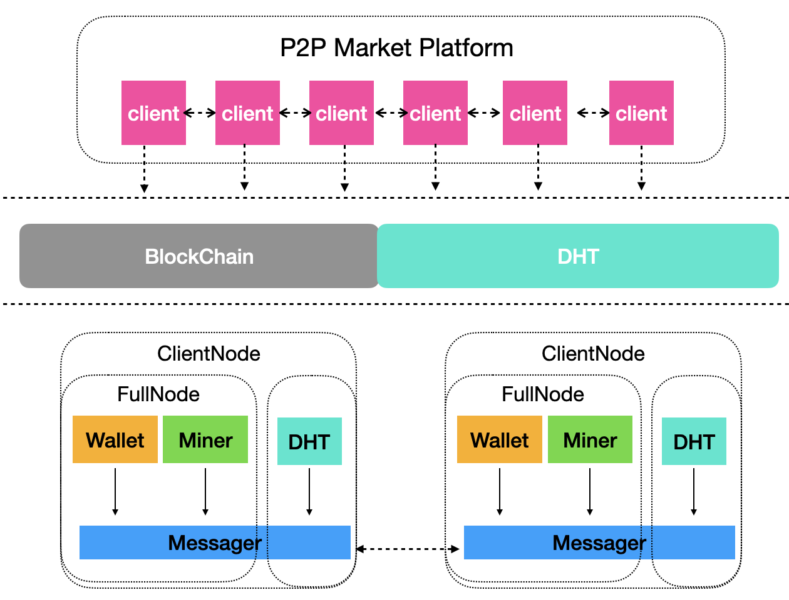
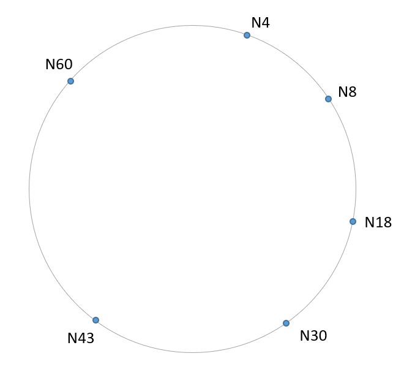
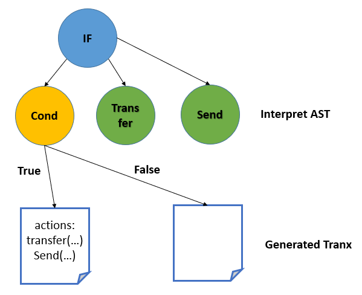
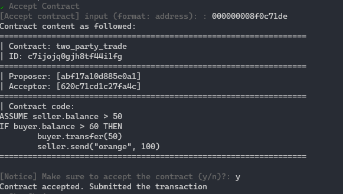
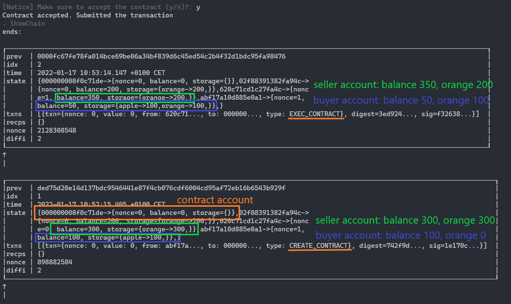

# MarketPeer: A P2P Digital Market Platform

Yifei Li, Liangyong Yu, Lin Yuan

## Introduction

Nowadays, e-commerce has become an indispensable part of our lives. Despite the convenience of these centralized platforms, they have several drawbacks. First of all, sellers and buyers each need to pay fees for the platform. Secondly, although maintained and secured by world's best engineers, these platforms are still under the risk of malicious attacks. We propose to establish a peer-to-peer online shopping platform, where the trades directly happen between buyers and sellers. Smart contract can make the transaction independently and automatically without the need of third-party organizations. In this "MarketPeer" platform, peers not only get rid of platform fees but also obtain better security.

## Blockchain Background

Blockchain is first proposed in Bitcoin whitepaper, which serves as an immutable and decentralized storage system especially for e-commerce. As its name indicates, Blockchain is a chain of blocks. Under the context of e-commerce system, each block could store multiple transaction information and together linking a linear history of transactions. To protect from malicious peers, Proof-of-Work (PoW) mechanisms and longest chain principles are applied, such that as long as the majority of the peers are "good", the storage's validity is preserved. By composing these key ingredients, Blockchain-based system could eliminate the requirement of any centralized and "trustworthy" third-parties. Besides, it even shows more appealing properties in security concerns. Different from Bitcoin, the Ethereum blockchain generalize the blockchain as a state machine. Each transaction can be seen as a state transition. This way, the Ethereum explicitly store the state in each block and allow fine-grained manipulation of the world state represented by the blockchain.

## Smart Contract Background

Currently, **Ethereum** is one of the most popular blockchains with smart contract functionality. We aim
to implement kind of “minimum viable smart contract” as a simplified version of Ethereum. Generally speaking, we borrow the basic ideas but simplify them in some aspects:

- **Contract Code**: Ethereum uses **Solidity**, an object-oriented, high-level language for implementing smart contracts. To fit the scope of our project, we define a the minimum set of primitives for contract code. 
- **Code Execution**: Ethereum compile the contract code and execute the bytecode in the **Ethereum Virtual Machine** (EVM). The environment is either isolated from the network and file system. We choose to implement interpreted execution, which transforms the AST to blockchain transaction.
- **Core Features**: Since the primitive is blockchain transaction, the smart contract can fulfill the core features including immutability and global distributability.


## Chord Background

Chord is a peer-to-peer distributed hash table. Compared with a traditional central storage system, data is distributed evenly in every node in Chord. It decreases the burden of the central server because all nodes in Chord share the responsibility to store data. Chord describes how a key-value pair is stored in the node, and how to find the storage location of a key-value pair.

All nodes in Chord form a ring, and their locations are calculated by hashing their IP addresses. When storing a key-value pair, the component of Chord looks up which node is responsible for the key-value pair. Chord also supports the condition that a node joins the system and a node suddenly leaves the system. In our project, for simplicity, we don't consider the situation that a node fails or a node leaves the system. 

One advantage of Chord is that the node in the system doesn't have to be aware of all nodes. Each node only needs to know a small amount of routing information of other nodes. Specifically, each node only saves the information of its predecessor and successor. And it keeps the finger table. If a key is beyond its responsibility, it will search the finger table and send the key to other nodes. When the number of nodes grows exponentially, the search time of the location of the key grows linearly. 

## Overall System Architecture & Functionalities



- Blockchain stores the digial assets and digital currencies; Regulate the transaction exeution and verification; a "ledger"
- DHT stores all other metadatas. Like the mapping between network address and account address, owner list of each product, product list of each owner, etc.
- Smart Contract provides application-level API for the end users. It allows the users to specify contract code, propose contract to blockchain and execute it automatically.

### Messager

The Messager interface is adapted from homework implemented Peer. Yet, we made several modifications to make it easier to use in our case:

- send functionalities directly use `types.Message`, such that caller need not marshal themselves
- add `Registry` functionalities

```go
type Messager interface {
  peer.Service
	RegisterMessageCallback(types.Message, registry.Exec)
	Unicast(dest string, msg types.Message) error
	Broadcast(msg types.Message) error
	AddPeer(addr ...string)
	GetNeighbors() []string
}
```

Putting together, anything built on top of Messager only need to define their specific sending logic and register the callbacks. The Messager interface hides the complexity while not hide the power.

## BlockChain Architecture & Functionalities

### Overview

The two key abstractions are *Wallet* and *Miner*. Together, they form a FullNode in the blockchain network. They both rely on *Messager* to send, register and process the messages. The Wallet abstraction offers an entry point to the blockchain network. Our client use wallet provided APIs to interact with blockchain. The Miners are the main components of the blockchain network. They are responsible for storing the blocks, verifying the transactions and blocks and produce new blocks.

### Wallet

Wallet serves as the entry point to the blockchain network. Clients uses its provided APIs to interact with blockchain.

```go
type Wallet interface {
  SyncAccount() error
  ShowAccount() AccountInfo
  TransferToken(dest account.Address, amount int) error
  ProposeContract(code string) (string, error)
  TriggerContract(dest account.Address) error
}
```

- `SyncAccount` acts like a *refresh*, which will fetch the latest account state from the blockchain. `ShowAccount` just shows the synced Account information, like digital balance and digital assets.
- `TransferToken` will create a new transaction and submit it to the network. We note it is a blocking function. Not until the wallet is sure the transaction is solidly stored in the blockchain or a timeout occurs, the function will not return.
- `ProposeContract`'s overall procedure is similar to `TransferToken`. It issues a `CREATE_CONTRACT` transaction with supplied code. Then, it tries to make sure the transaction is stored until timeout occurs. Finally it returns the contract address and result.
- `TriggerContract` 's overall procedure is similar to `TransferToken`. The difference is that its dest is a contract address.

To faciliate above functionalites, we define several new messages: (1) `TransactionMessage` (2) `VerifyTransactionMessage` and `VerifyTransactionReplyMessage` (3) `SyncAccountMessage` and `SyncAccountReplyMessage`, where the reply messages is sent from the miners in the network.

### Miner

The miners are the key components of the blockchain network, they are responsible for 

- physically store the blocks in the blockchain
- verify and execute the transactions sent by Wallets
- produce new blocks based on Bitcoin-style PoW, and broadcast it to other miners
- verify the blocks broadcasted by other miners. if it finds it lags behind a lot of blocks, it will ask other miner for latest blocks.

As we adopt ethereum-alike blockchain network. The biggest difference from Bitcoin block is that it also contains the `WorldState`, which is a mapping between `AccountAddress` and `AccountState`. The `AccountState` is also a KV representing the digial assets. Further, we make serveral simplified assumptions: (1) the difficulty of the network is fixed, not dynamically adapted; (2) use hash map rather than Merkle tree as the KV interface. To faciliate above functionalites, we also define a new message: `BlockMessage` which is used to broadcast the block to other miners.

## Chord Architecture & Functionalities

### Overview

The chord system offers two APIs: Put(save a key-value pair into a node) and Get(find the owner of a key and read the value). Each node has an address in the chord. Usually, the address is the hash value of the IP address of the node. The following picture is an example of the chord system. All nodes form a ring, and key-value pairs are evenly distributed in this ring. 


### Predecessor and Successor
Each node saves the address of its predecessor and successor. In this example, the predecessor of N4 is N60, and the successor of N4 is N8. Each node should update its predecessor and successor frequently because a new node can join the system at any time. 

### Finger Table
Each node keeps its finger table locally. The finger table is used for finding the closest predecessor of a given key. For example, the following table shows the finger table of N4:

| distance | item |
| -------- | ---- |
| 1        | N8   |
| 2        | N8   |
| 4        | N8   |
| 8        | N18  |
| 16       | N30  |
| 32       | N43  |

When distance is 1, the id of the corresponding key is 4 + 1 = 5. The successor of this key is N8, so the item is N8. In the following section, we will discuss that the finger table is very useful to find the successor of a corresponding key.

### Find Successor
When we save a key into Chord, we would like to find the successor of this key. However, the node in Chord doesn't have a global view of the system, a node can't directly find the successor of this key. Therefore, a node searches the finger table and looks for the closest predecessor of this key, and then asks it to find the successor of this key.

### Join a new node
When a new node joins the Chord system, assume its hash value is k, firstly it should find its successor k* in the Chord. Secondly, it invokes Notify() to tell its successor that it has joined the system. When the successor receives the notify message, it sets the predecessor to ask and transfer some key-value pairs whose key is smaller than the new predecessor. 

### Updating the information of Chord
Each node should periodically invoke Notify() to tell the successor its existence. When the successor receives the notify, it judges whether the value of the node is larger than its previous predecessor; if yes, it sets a new predecessor. What's more, each node updates its finger table periodically. When a new node joins the system, Notify() only makes its predecessor and successor aware of its existence. It is the finger table that makes the whole system know that a new node joins. 


## Smart Contract Architecture & Functionalities

### Contract Code

To make the smart contract "minimum viable", we define a set of primitives to formulate the contract code language. It was designed specifically for this application: execute a set of actions as an independent transaction, according to some conditions. The language mainly consists of two types of operations:

- `ASSUME` makes assumptions of the contract. It represents preconditions to execute the contract. Contract execution is performed only when all assumption conditions are met. Usually, the proposer may have requirements for the balance in the seller's account. In the example below, `ASSUME seller.balance > 50` requires at least 50 balance in seller's account.
- `IF-THEN` claims the if clauses of the contract. It consists of conditions and several items of actions. We use reserved words like `seller`, `buyer` here to be replaced with account addresses. In the example below, we make sure that transfer and shipment actions are both performed. It deals with the need of a trusted third party in decentralized application scenario.

```
ASSUME seller.balance > 50
IF seller.reputation > 80 THEN
 	buyer.transfer(100)
	seller.send("book", 2)
```

In our application, users can write their contract code and propose it. Then will we process the contract as other types of interpreted language: `Lexer` to split tokens, `Parser` to parse the code to abstract syntax tree (AST), and `Interpreter` to evaluate the AST. The figure below shows the interpretation process of If clauses in the AST.

- `Lexer` converts the high-level input program into a sequence of tokens. We predefine the form of each type of tokens with regular expression.
- `Parser` performs syntax analysis on the lexical analysis result. We construct the parser given the BNF of contract language. Parser will output the AST as the structured code.
- `Interpreter` traverse the AST and generate the expected output. In our case, the interpreter checks the conditions and collects satisfied actions as the blockchain transaction.



### Contract Structure

Contract implements the interface of the SmartContract. Blockchain miners can perform contract creation and contract execution transactions, with the APIs provided by SmartContract.

```go
type SmartContract interface {
    GetProposerAccount() (string)
    GetAcceptorAccount() (string)
    ValidateAssumptions(storage.KV) (bool, error)
    CollectActions(storage.KV) ([]Action, error)
}

type Contract struct {
    contract.SmartContract
    Proposer_account string
    Acceptor_account string
    Code_plain_text string
    Code_ast parser.Code
    Code_state_tree StateTree
    ...
}
```

- `ValidateAssumptions` checks the assumption conditions given the world state of the blockchain. `CollectActions` collects all satisfied actions to encapsulate in the blockchain transaction. They jointly support the contract execution in the blockchain.
- `Proposer_account` and `Acceptor_account` specifies the address of two parties. The two fields are required when proposing the contract to blockchain.
- `Code_ast` stores the AST parsed from `Code_plain_text`. We also construct a corresponding `Code_state_tree` to trace the state of each node in the AST.

### Contract Execution

We explain the process of contract execution with the figure below. Miners are omitted for simplicity.


1. `Propose Contract`: After retrieving the product information from DHT, the buyer can write the contract code and propose it to blockchain. A `CREATE_CONTRACT` transaction is submitted, and some miner will create the contract account in the blockchain.
2. `Inform Contract`: The proposer will receive the contract account address so that he can inform the seller of the contract. To validate the contract content, the seller would prefer to view it in the blockchain by itself.
3. `Accept Contract`: Once the seller is satisfied with the contract, it can trigger the contract execution by submitting a `EXEC_CONTRACT` transaction.
4. `Execute Contract`: Supported with `SmartContract` APIs, any miner can execute the contract code then submit the state change. Since the execution is supported by blockchain transaction, features like **immutability** and **global distributability** are satisfied.


## Fine-grained team contribution

Main contribution is highlighted with bold text.

- Liangyong Yu:
  - Distributed Hash Table: **design, implement and test the Distributed Hash Table**
  - BlockChain: implement the execution of contract-creation 
  - SmartContract: None
  - Client: **design, implement and test the ClientNode in the market place**
  - CLI: **design and implement the CLI.**
- Lin Yuan:
  - Distributed Hash Table: None
  - BlockChain: implement the contract-related transaction submission, verification and execution.
  - SmartContract: **design, implement and test the SmartContract**
  - Client: None
  - CLI: starting code
- Yifei Li:
  - Distributed Hash Table: None
  - BlockChain: **design, implement and test the Blockchain functionalities.** 
  - SmartContract: None
  - Client: None
  - CLI: starting code and configuaration specifications.

## System Evaluation


### Chord evaluation

We create some unit tests to evaluate the correctness of Chord. For simplicity, all nodes wouldn't be failed. Our system should initialize a Chord system, whose nodes have the correct predecessor, successor, and finger table. What's more, When a new node joins the system, the whole system should be aware of its existence, and some keys stored in Chord should be transferred to the new node. 

The first unit test we build is to create a ten-node chord system. In the test program, we collect the hash value of each node and reconstruct the expected predecessors, successors, and finger tables of each node. And then we start the chord system. When the network is stable, we compare the predecessors, successors, and finger tables of each node and expected values. 

The second unit test is to store some key-value pairs and read them in Chord. First, we create a Chord system composed of ten nodes. When the network is stable, we generate some key-value pairs and store them in Chord, and then we read these key-values pairs from Chord. We evaluate that the owner of the key is correct, and values should be unchanged after saving and reading operations. 

The third unit test is to join some new nodes into Chord. First, we initialize a Chord system with only two nodes and store some key-value pairs into it. When the network is stable, eight nodes join the system simultaneously. In this process, the successors, predecessors, and finger tables of the original two nodes would change, and they should transfer some key-value pairs to the newly joined nodes. Finally, We read all key-value pairs from Chord and evaluate that the owner of the key is correct.


### Client evaluation
We warp Chord and Blockchain into a Client node. In this section, we create some unit tests to form the Chord system, transfer account, and execute transactions.

The first unit test is to from the Chord system. Like Chord evaluation, we create ten client nodes and form a Chord system, and insert some key-values pairs. We test that the network topology is correct, and key-value pairs are distributed into the correct client node.

The second unit test is to submit some transactions. We create three nodes. Each node submits a transaction. We evaluate that the blockchain in each node shows the transactions are saved in the block and the accounts of nodes change expectedly. 


The third unit test is to transfer accounts among client nodes. We create three nodes and ask node 1 to transfer some money to node 2. We evaluate that the transaction should be received by all nodes and be packed inside a block. 


### BlockChain Evaluation

Considering our implemented blockchain is layer-1 and PoW based, its TPS is bounded by the PoW process and broadcast overhead. The performance is not a vital metric. So we mainly evaluate the *correctness* and *availability* of the blockchain under different settings. For all evaluations below, we fix the PoW difficulty, such that each block is mined every ~500ms. And each block only contains one transaction.

#### Without attackers

For each evaluation, we will specify different number of nodes and different topography. Then the nodes will submit some valid transactions concurrently. The expected result is (1) all transactions should be succuessful eventually (2) the chain in each miner should be the same eventually. The test code can be found in `blockchain/tests`.

- 3 nodes, complete graph. every node will do two value transfers
- 5 nodes, 1,2,3 complete subgraph, 4,5 complete subgraph. 1<->4, 2<->5. node 1, 2, 3 will do two value transfers respectively and concurrently
- 7 nodes, 1,2,3 complete subgraph, 4,5 complete subgraph, 6,7 complete subgraph. 1<->4, 2<->5; 3<->7,6<->4; node 1, 2, 3 will do five value transfers respectively and concurrently

All tests are in expectation and the TPS is approximately 1, which is consistent with the blocking mining time.

#### With attackers

- 5 nodes, 1,2,3 complete subgraph, 4,5 complete subgraph; node 2, 3 will do two value transfers respectively and concurrently. attacker 1 will submit 4 transactions
- attack mode: attacker ignore others' transactions and block, only verify its own submitted transactions.
- expectation: node 2,3,4,5 have consistent blockchain and not affected by attacker 1

Good nodes have higher CPU power, such that their agreed chain is always longer than the attacker, so attacker has no chance to inject his faulty transaction to the chain. The test results are consistent with expectations. For the same index of the block, the good block timestamp is always smaller than the bad block, implying that the good chain is always longer.

### Smart Contract Evaluation

We evaluate the correctness of smart contract in a network of 3 nodes. Since we assume that each contract has only 2 parties: buyer and seller, extra nodes will not affect the correctness. Each node is full node and can execute the contract as miner.

**Contract Code**: According to the code, buyer will buy 100 oranges with the price of 50. 



**BlockChain Result**: According to the figure below, the first block stores the transaction to create the contract account. The second block stores the transaction to execute the contract. After the execution, the seller's balance increases by 50 and buyer's balance decreases by 50. The buyer gets 100 oranges from the seller. The two actions are performed in the same transaction so the semantics of smart contract has been satisfied.




