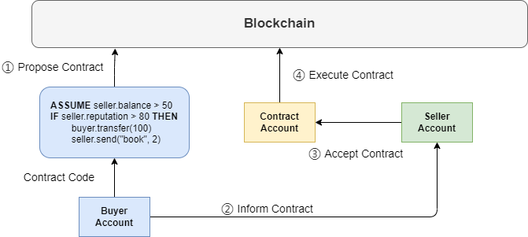

# MarketPeer: A P2P Digital Market Platform

Yifei Li, Liangyong Yu, Lin Yuan

## Introduction


## Smart Contract Background

Currently, **Ethereum** is one of the most popular blockchains with smart contract functionality. We aim
to implement kind of “minimum viable smart contract” as a simplified version of Ethereum. Generally speaking, we borrow the basic ideas but simplify them in some aspects:

- **Contract Code**: Ethereum uses **Solidity**, an object-oriented, high-level language for implementing smart contracts. To fit the scope of our project, we define a the minimum set of primitives for contract code. 
- **Code Execution**: Ethereum compile the contract code and execute the bytecode in the **Ethereum Virtual Machine** (EVM). The environment is either isolated from the network and file system. We choose to implement interpreted execution, which transforms the AST to blockchain transaction.
- **Core Features**: Since the primitive is blockchain transaction, the smart contract can fulfill the core features including immutability and global distributability.


## Overall System Architecture & Functionalities


- Blockchain stores the digial assets and digital currencies; Regulate the transaction exeution and verification; a "ledger"
- DHT stores all other metadatas. Like the mapping between network address and account address, owner list of each product, product list of each owner, etc.
- Smart Contract provides application-level API for the end users. It allows the users to specify contract code, propose contract to blockchain and execute it automatically.

### Messager

The Messager interface is adapted from homework implemented Peer. Yet, we made several modifications to make it easier to use in our case:

- send functionalities directly use `types.Message`, such that caller need not marshal themselves
- add `Registry` functionalities

```go
type Messager interface {
  peer.Service
	RegisterMessageCallback(types.Message, registry.Exec)
	Unicast(dest string, msg types.Message) error
	Broadcast(msg types.Message) error
	AddPeer(addr ...string)
	GetNeighbors() []string
}
```

Putting together, anything built on top of Messager only need to define their specific sending logic and register the callbacks. The Messager interface hides the complexity while not hide the power.

## BlockChain Architecture & Functionalities

### Overview

The two key abstractions are *Wallet* and *Miner*. Together, they form a FullNode in the blockchain network. They both rely on *Messager* to send, register and process the messages. The Wallet abstraction offers an entry point to the blockchain network. Our client use wallet provided APIs to interact with blockchain. The Miners are the main components of the blockchain network. They are responsible for storing the blocks, verifying the transactions and blocks and produce new blocks.

### Wallet

Wallet serves as the entry point to the blockchain network. Clients uses its provided APIs to interact with blockchain.

```go
type Wallet interface {
  SyncAccount() error
  ShowAccount() AccountInfo
  TransferToken(dest account.Address, amount int) error
  ProposeContract(code string) (string, error)
  TriggerContract(dest account.Address) error
}
```

- `SyncAccount` acts like a *refresh*, which will fetch the latest account state from the blockchain. `ShowAccount` just shows the synced Account information, like digital balance and digital assets.
- `TransferToken` will create a new transaction and submit it to the network. We note it is a blocking function. Not until the wallet is sure the transaction is solidly stored in the blockchain or a timeout occurs, the function will not return.
- `ProposeContract`'s overall procedure is similar to `TransferToken`. It issues a `CREATE_CONTRACT` transaction with supplied code. Then, it tries to make sure the transaction is stored until timeout occurs. Finally it returns the contract address and result.
- `TriggerContract` 's overall procedure is similar to `TransferToken`. The difference is that its dest is a contract address.

To faciliate above functionalites, we define several new messages: (1) `TransactionMessage` (2) `VerifyTransactionMessage` and `VerifyTransactionReplyMessage` (3) `SyncAccountMessage` and `SyncAccountReplyMessage`, where the reply messages is sent from the miners in the network.

### Miner

The miners are the key components of the blockchain network, they are responsible for 

- physically store the blocks in the blockchain
- verify and execute the transactions sent by Wallets
- produce new blocks based on Bitcoin-style PoW, and broadcast it to other miners
- verify the blocks broadcasted by other miners

As we adopt ethereum-alike blockchain network. The biggest difference from Bitcoin block is that it also contains the `WorldState`, which is a mapping between `AccountAddress` and `AccountState`. The `AccountState` is also a KV representing the digial assets. Further, we make serveral simplified assumptions: (1) the difficulty of the network is fixed, not dynamically adapted; (2) use hash map rather than Merkle tree as the KV interface. To faciliate above functionalites, we also define a new message: `BlockMessage` which is used to broadcast the block to other miners.


## Smart Contract Architecture & Functionalities

### Contract Code

To make the smart contract "minimum viable", we define a set of primitives to formulate the contract code language. It was designed specifically for this application: execute a set of actions as an independent transaction, according to some conditions. The language mainly consists of two types of operations:

- `ASSUME` makes assumptions of the contract. It represents preconditions to execute the contract. Contract execution is performed only when all assumption conditions are met. Usually, the proposer may have requirements for the balance in the seller's account. In the example below, `ASSUME seller.balance > 50` requires at least 50 balance in seller's account.
- `IF-THEN` claims the if clauses of the contract. It consists of conditions and several items of actions. We use reserved words like `seller`, `buyer` here to be replaced with account addresses. In the example below, we make sure that transfer and shipment actions are both performed. It deals with the need of a trusted third party in decentralized application scenario.

```
ASSUME seller.balance > 50
IF seller.reputation > 80 THEN
 	buyer.transfer(100)
	seller.send("book", 2)
```

In our application, users can write their contract code and propose it. Then will we process the contract as other types of interpreted language: `Lexer` to split tokens, `Parser` to parse the code to abstract syntax tree (AST), and `Interpreter` to evaluate the AST. The figure below shows the interpretation process of If clauses in the AST.

- `Lexer` converts the high-level input program into a sequence of tokens. We predefine the form of each type of tokens with regular expression.
- `Parser` performs syntax analysis on the lexical analysis result. We construct the parser given the BNF of contract language. Parser will output the AST as the structured code.
- `Interpreter` traverse the AST and generate the expected output. In our case, the interpreter checks the conditions and collects satisfied actions as the blockchain transaction.


### Contract Structure

Contract implements the interface of the SmartContract. Blockchain miners can perform contract creation and contract execution transactions, with the APIs provided by SmartContract.

```go
type SmartContract interface {
    GetProposerAccount() (string)
    GetAcceptorAccount() (string)
    ValidateAssumptions(storage.KV) (bool, error)
    CollectActions(storage.KV) ([]Action, error)
}

type Contract struct {
    contract.SmartContract
    Proposer_account string
    Acceptor_account string
    Code_plain_text string
    Code_ast parser.Code
    Code_state_tree StateTree
    ...
}
```

- `ValidateAssumptions` checks the assumption conditions given the world state of the blockchain. `CollectActions` collects all satisfied actions to encapsulate in the blockchain transaction. They jointly support the contract execution in the blockchain.
- `Proposer_account` and `Acceptor_account` specifies the address of two parties. The two fields are required when proposing the contract to blockchain.
- `Code_ast` stores the AST parsed from `Code_plain_text`. We also construct a corresponding `Code_state_tree` to trace the state of each node in the AST.

### Contract Execution

We explain the process of contract execution with the figure below. Miners are omitted for simplicity.



1. `Propose Contract`: After retrieving the product information from DHT, the buyer can write the contract code and propose it to blockchain. A `CREATE_CONTRACT` transaction is submitted, and some miner will create the contract account in the blockchain.
2. `Inform Contract`: The proposer will receive the contract account address so that he can inform the seller of the contract. To validate the contract content, the seller would prefer to view it in the blockchain by itself.
3. `Accept Contract`: Once the seller is satisfied with the contract, it can trigger the contract execution by submitting a `EXEC_CONTRACT` transaction.
4. `Execute Contract`: Supported with `SmartContract` APIs, any miner can execute the contract code then submit the state change. Since the execution is supported by blockchain transaction, features like **immutability** and **global distributability** are satisfied.


## Fine-grained team contribution

Main contribution is highlighted with bold text.

- Liangyong Yu:
  - Distributed Hash Table: **design, implement and test the Distributed Hash Table**
  - BlockChain: implement the execution of contract-creation 
  - SmartContract: None
  - Client: **design, implement and test the ClientNode in the market place**
  - CLI: **design and implement the CLI.**
- Lin Yuan:
  - Distributed Hash Table: None
  - BlockChain: implement the contract-related transaction submission, verification and execution.
  - SmartContract: **design, implement and test the SmartContract**
  - Client: None
  - CLI: starting code
- Yifei Li:
  - Distributed Hash Table: None
  - BlockChain: **design, implement and test the Blockchain functionalities.** 
  - SmartContract: None
  - Client: None
  - CLI: starting code and configuaration specifications.

## System Evaluation

### BlockChain Evaluation

- all good nodes
  - 3 nodes. node submit txns
  - what if fork happens
  - concurrent submit txns

- attackers to the PoW
  - fork handles
  - attacker cannot rule the network. as long as it is below 51%
  - 51% attack

- - ​


### Smart Contract Evaluation

We evaluate the correctness of smart contract in a network of 3 nodes. Since we assume that each contract has only 2 parties: buyer and seller, extra nodes will not affect the correctness. Each node is full node and can execute the contract as miner.

**Contract Code**: According to the code, buyer will buy 100 oranges with the price of 50. 


**BlockChain Result**: According to the figure below, the first block stores the transaction to create the contract account. The second block stores the transaction to execute the contract. After the execution, the seller's balance increases by 50 and buyer's balance decreases by 50. The buyer gets 100 oranges from the seller. The two actions are performed in the same transaction so the semantics of smart contract has been satisfied.


## unused

